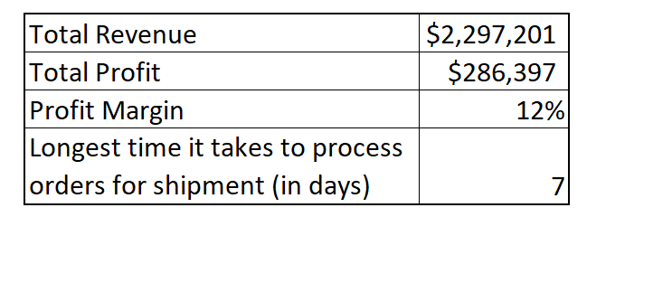
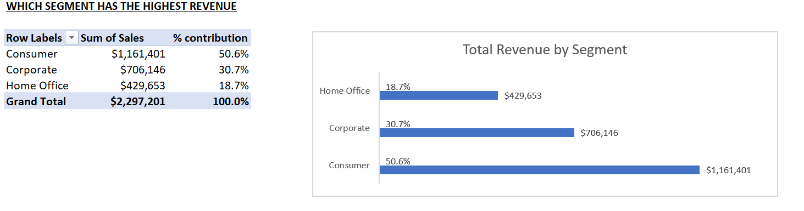
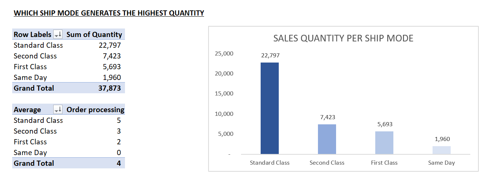
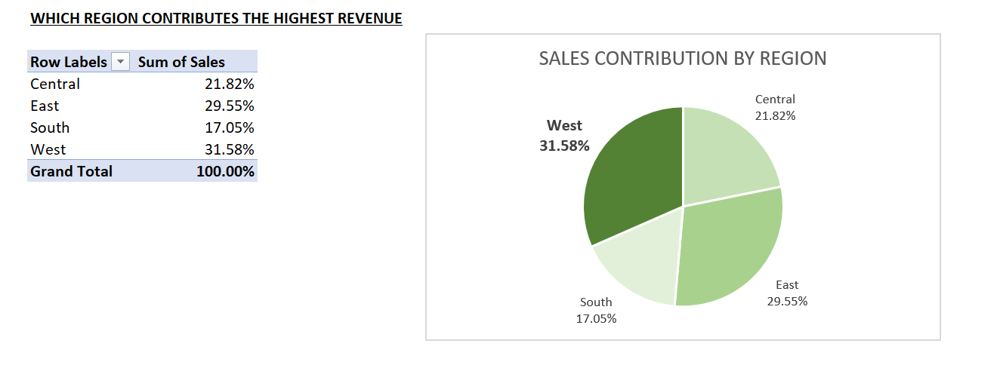
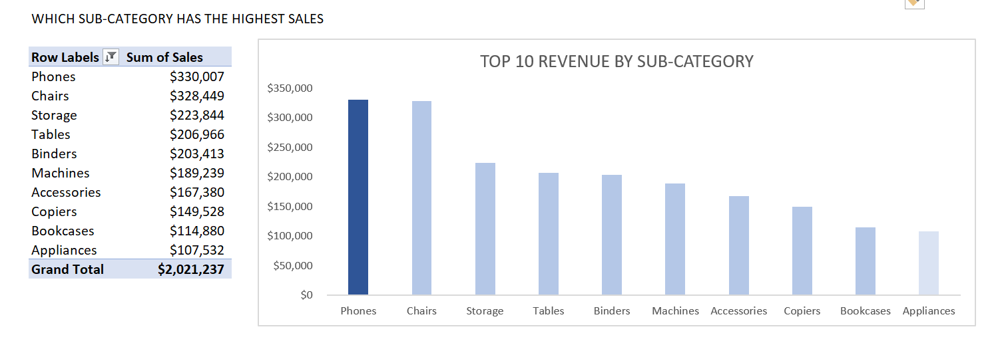
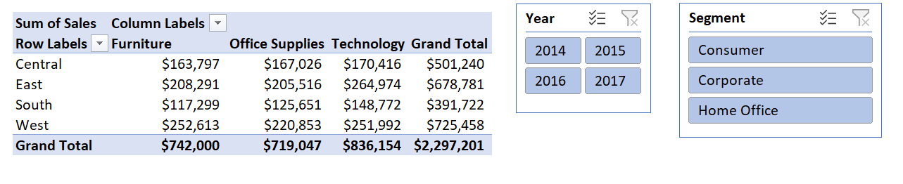

# Detailed-Analysis-of-US-Superstore-data

## Introduction
This analysis is based on a dataset of sales volumes and values by Segment,State and other factors with specific order dates and shipment dates per customer and per Order. I took a deep dive into the key drivers of the Sales so as to see areas where we can improve the overall business performance. 

## *KPIs*
I have selected some key performance index i want us to pay attention to.

   

I calculated the Total Revenue and Total Profit by using the SUM Function, while the profit margin is Total profit/Total Revenue.
I also used the MAX function to get the longest time it takes to process orders.

## KEY INSIGHTS GENERATED
1. Which Segment Has The Highest Revenue
2. Which Ship Mode Generates The Highest Quantity
3. Which Region Contributes The Highest Revenue
4. Which Sub-Category Has The Highest Sales 

To answer and present my data appropriately, I created several pivot tables and Visuals to support my insights.

1. Which Segment Has The Highest Revenue.
   
   
   
  The Consumer Segment has the highest revenue per segment with over 50% of the revenue followed by the Corporate Segment with 31% and the Home office with 19%
   
2. Which Ship Mode Generates The Highest Quantity.
   
   
   
  The Standard Class ship mode generated the highest Sales quantity (over 60%) while same day delivery generates the lowest. This is interesting as it takes an average of 5days to process the orders for Standard class which is more than the same day order.
   
3. Which Region Contributes The Highest Revenue.
   
   

  The West Region generates the highest sales revenue while the South generates the least

4. Which Sub-Category Has The Highest Sales 
   
   

  The Phones Sub category has the highest Revenue in the Top 10, while the Appliance sub category has the lowest in the Top 10
   

## SLICER

 

   The data shows Sales by Sub category and Region. I have now inserted a slicer to enable us drill down into any Year we want and Segment we want within the Subcategory and Region data we can see. Once you click on any of the data in the slicer, you will get a filtered data as per what was selected     in   the slicer.

## CONCLUSION AND RECOMMENDATION
The data shows that we have high sales in the phones sub-category, Consumer segment, Standard class ship mode and West region.

The recommendations are therefore;
1. Improve on the time it takes to process order so we can save time processing orders and spend more time getting new orders.
2. Focus more on the Standard class ship mode as that is a significant part of the business.
3. Pay more attention to the Consumer segment of the business. A Customer relationship/retention management system is needed to optimise this.
